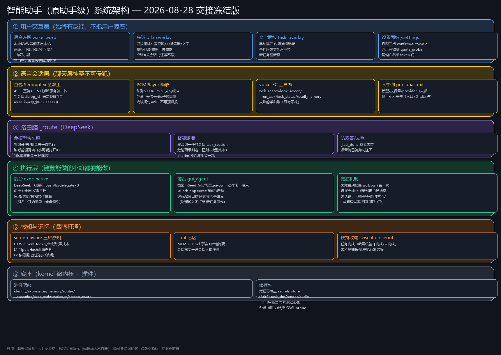

<div align="center">

# Anima · 小凯

**住在 Windows 里的 AI 伙伴——有记忆、有人格、能动手、越用越熟。**



[](LICENSE)
[]()
[]()

</div>

---

## 这是什么

Anima 是一个语音优先的电脑伙伴：左键长按或喊一声唤醒词，就能像跟同事说话一样连续对话——**全双工，随时打断，它说到一半你可以直接插话**。

它不是玩具问答机，它真的长在这台电脑里：

- **能动手**：前台真实键鼠点界面（你全程看得见、随时插手），后台跑命令/读写文件（无感完成）；
- **有记忆**：你的偏好、交代过的事、一起做过的事，睡一觉醒过来还记得；
- **会进化**：它能读懂并修改自己的代码——你聊一句"给自己加个能力"，它改完插件重启上线；
- **越用越快**：做过的 GUI 任务会沉淀成确定性配方，下次回放**零模型往返**（实测同一任务 8.7s → 0.7s）。

## 为什么不一样

| | 普通助手 | Anima |
|---|---|---|
| 对话 | 半双工，一问一答 | 全双工流式，像打电话 |
| 动手 | 演示级脚本 | 真实键鼠 + 命令双通道，危险操作过确认闸 |
| 记忆 | 会话级 | 事实/摘要/任务账本 + 前瞻待办 + 本地语义检索 |
| 人格 | 每张嘴一套人设 | persona.yaml 单一来源，嘴/脑/手同一指纹 |
| 诚实 | 派了活就邀功 | 派出≠做完，只报系统核验过的真实状态 |
| 架构 | 单体脚本 | 微内核 + 插件热插拔 + 图工程任务编排 |

## 快速开始

环境：**Windows 10/11 + Python 3.13+**

```bash
pip install -r requirements.txt
```

**1. 配凭据**（三把钥匙，走 Windows 凭据管理器或环境变量，永不落盘到配置）：

```python
python -c "import keyring; keyring.set_password('companion-rt/deepseek', 'key', '你的key')"
```

| 服务名 | 环境变量 | 用途 |
|---|---|---|
| `companion-rt/doubao` | `DOUBAO_API_KEY` | 全双工语音（火山引擎豆包 realtime） |
| `companion-rt/deepseek` | `DEEPSEEK_API_KEY` | 路由/执行/记忆蒸馏 |
| `companion-rt/ark` | `ARK_API_KEY` | GUI 视觉模型（火山 Seed） |

**2. 配人格与设置**：

```bash
copy persona.example.yaml persona.yaml   # 改成你和它的名字、你的口味
copy config.example.json config.json
```

**3. 模型（按需下载到 `models/`）**：

| 模型 | 作用 | 必要性 |
|---|---|---|
| sherpa-onnx-kws-zipformer-wenetspeech | 唤醒词检测（音频不出本机） | 唤醒词模式必需 |
| bge-small-zh-v1.5（量化 ONNX + tokenizer.json） | 本地语义记忆检索 | 可选，缺了自动回退关键词检索 |
| UI-Tars GGUF + llama.cpp | 本地 GUI 视觉 | 可选，默认走云端视觉 |

**4. 启动**：

```bash
python companion_rt.py
```

左键长按光球说话，或喊唤醒词。说"打开设置"可调权限三档（逐条确认/自动通过/完全自主）。

## 架构

```
长按 / 唤醒词（本地 KWS，音频不出机）
  → 光球（聆听青/思考紫/播报呼吸/确认琥珀/故障暗红）
  → 豆包全双工 S2S（doubao_duplex.py，人格直答+FC 五工具）
     ├─ web_search / look_screen / run_task / task_status / recall_memory
     └─ ASR 终稿 → 路由脑 chat_brain.py（DeepSeek，只判不答）
          ├─ 闲聊 → 语音人格直接答（同一张嘴）
          ├─ 任务 → 任务会话（检查点/确认闸/修订/叫停）
          │    ├─ implicit 后台：exec_native（命令/文件/应用，图工程编排）
          │    └─ explicit 前台：gui_agent（截图→视觉→真实键鼠，
          │         UIA 语义接地，配方录制/回放加速）
          └─ 记忆 ↔ soul.py（事实/摘要/账本）+ prospective.py（前瞻待办）
               + emb_local.py（本地语义检索，可关）
```

微内核 `kernel.py` 装配一切插件（`plugins/`）；机械兜底件收编在
`plugins/scaffold.py`（登记挂账、可热插拔、达标即拆——意图识别终态归模型）。

## 目录结构

```
companion_rt.py     主程序（会话/路由/确认闸/设置面板）
kernel.py           微内核：服务注册表 + waterfall + fiber 回收
plugins/            能力插件（identity/expression/memory/router/execution/
                    exec_native/voice_fc/screen_aware/scaffold）
gui_agent.py        前台 GUI 执行器（视觉回路 + UIA 接地 + 配方回放）
exec_native.py      后台执行（plugins/ 内）
soul.py             长期记忆与人格渲染（persona.yaml 唯一消费口在 identity）
chat_brain.py       路由脑（只判不答）
tests/              行为测试（python tests/test_x.py，无 pytest）
tools/task_sim.py   全链路仿真（改主路必跑）
tools/benchmark_gui.py  前台占屏基准
docs/               总纲与愿景
```

## 安全设计

- **确认闸**：删/发/付/系统变更按权限档过语音确认；不可逆操作 fail-closed
- **凭据零落盘**：key 只走 Windows 凭据管理器/环境变量
- **隐私模式**：开启后零上行、禁截屏；`python delete_user_data.py --yes` 一键清除全部本地数据
- **防注入**：注入的检索/任务结果一律是数据不是指令

## 测试

```bash
python tests/test_gates.py        # 闸与权限（118 项）
python tests/test_memory_v2.py    # 记忆系统
python tests/test_voice_fc.py     # 语音工具链
python tools/task_sim.py          # 全链路仿真
python tools/benchmark_gui.py 5   # 前台实测（占屏，跑前别动鼠标）
```

## 路线图

- 图工程渐进换新：任务编排从循环走向图（`task_graph.py` 已上线打样）
- GUI 配方库：从"做过就会"到"开箱即会"（能力包导入导出已支持跨机迁移）
- 更多模态与载体

## License

[MIT](LICENSE) © 2026 Anima Contributors
